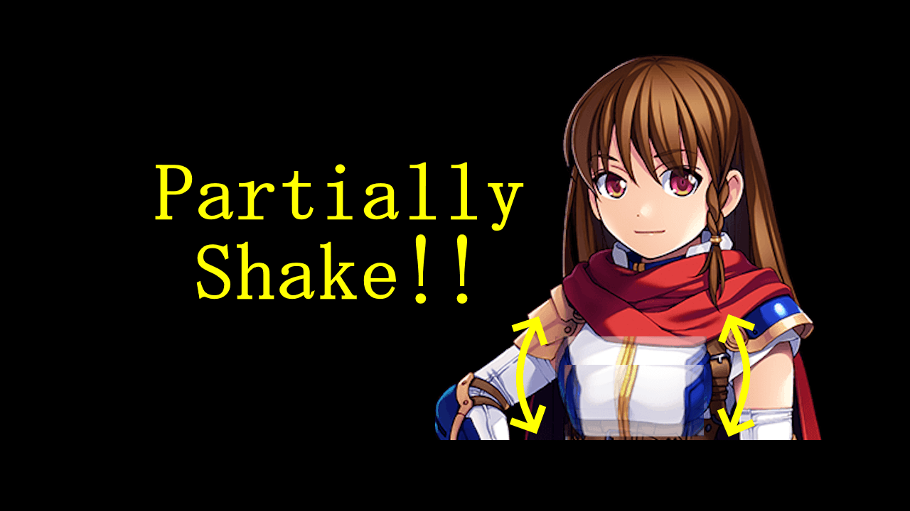

## ピクチャ部分シェイク・プラグイン（NLM_PartiallyShakePicture.js）
### RPGツクールMZ/MV両用プラグイン

ピクチャの一部範囲のみをシェイクさせます

- MZの場合は、プラグインコマンドで簡単に実行できます  
- MVの場合は、プラグインヘルプ記載のスクリプトで実行して下さい

### 注意

- ピクチャの不透明度は 255 に設定して下さい（低値だと表示が乱れます）
- 利用するCGの著作権は遵守して下さい

# download

プラグインの download は、[右クリック「名前を付けてリンク先を保存」](https://raw.githubusercontent.com/nolimits-tukool/NLM_PartiallyShakePicture/refs/heads/main/NLM_PartiallyShakePicture.js)  
RPGツクールMZ/MV両用です

Windows11の[「スマートアプリコントロール」でブロックされる場合](https://github.com/nolimits-tukool/HandlingSmartAppControl)

# license

　MITライセンスの通りです

## [リポジトリ 一覧へ](https://github.com/nolimits-tukool?tab=repositories)
